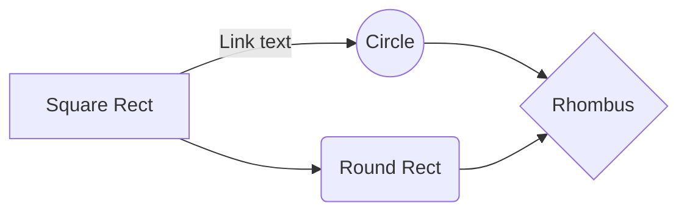
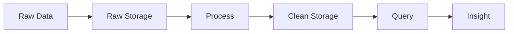
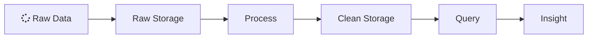

[gatsby-remark-graph](https://github.com/konsumer/gatsby-remark-graph) is a plugin to allow [MermaidJS](https://mermaidjs.github.io/) diagrams in Markdown code blocks.

````

````

generates this diagram:


and 

````

````

will give you this:


