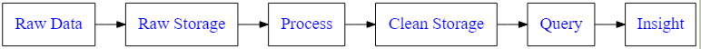
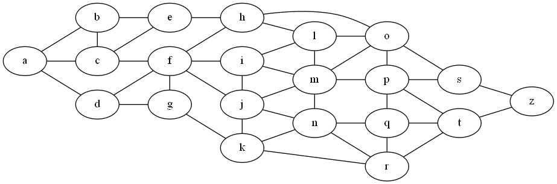
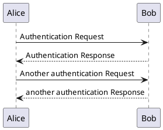

[Graphviz](https://www.graphviz.org) graphs can be represented as text using the DOT language. What-if you could take DOT language and transform it into images in a markdown document?

One way might be to generate the images as png/jpg or other format ahead of time then embed the image. Another way might be to embed the code directly in the markdown document as fenced code blocks and do some processing behind the scenes to generate the image or an SVG element in the HTML that gets generated in the pipeline that transforms markdown to HTML. In my case I am using Visual Studio Code and Gatsby to generate a static site on Github Pages. This means there a hooks in many different places to acheive these goals and more. 

There are hooks:

* In Visual Studio Code to add extensions
* In Gatsby to add transform and other plugins
* In React becuase Gatsby is based on React

The image workflow for Graphviz could go something like this:

Add the [GraphViz Preview extension](https://github.com/EFanZh/Graphviz-Preview) to VSC. This alows a DOT file to be rendered as an image in another VSC pane.

* Create a DOT file
* In VSC open the dot file and preview the graph
* Use Snagit to capture the preview
* Paste the Preview link into index.md

This is not perfect but it works:

Here is a graph created using the above workflow:



The current VSC extension uses the graphviz dot bin to generate svg and emded it in a preview window. I wonder if I can capture the SVG and embed that in my document or save as an image file automatically?

Is there a better workflow? I have tried a gatsby add in that supports mermaid which allows you to create a fenced code code block that uses the merlin syntax but it does not actually work seamlessly with my gatsby installation and startter kit for some reasons that I have not quite figured out.

Here is another possible workflow:

* Install a run shell command like [Shell for VSCode](https://github.com/bbenoist/vscode-shell.git)
* Ensure dot is on the path
* Run a shell command from the Command Palette like ```dot -Tpng -o./images/sample2.png sample.dot```

With our sample.dot 


this creates the following png file:


That's pretty nice. It needs testing with a wide variety of graphs but it feels like it could be enhance into an extension that can be run easily without leaving VSC or your editing flow.

Here is another sample:



## Gravizo

[Gravizo](https://gravizo.com) is a cloud service that supports DOT, PlantUML, UMLGraph and SVG (in JSON)

Here is an example from their website:

``` html

```


How about our previous sample:


 That that does not work as expected.

 ## PlantUML



## LucidChart


