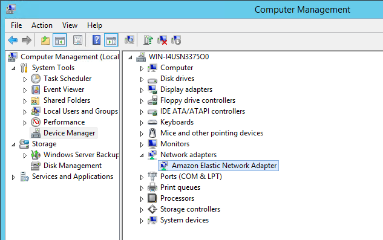

## Introduction

The new Tableau Extract Engine has some great performance improvements when creating and using extracts. When creating extracts though we are still subject to database and network limitations.

I want to explore what you can do when your Tableau Instance is on EC2 and you can take advantage of some of the Enhanced Network capabilities of EC2. I am focused on Intra Region connections (Redshift as a Data Source for example) and Windows but some of the principles here should apply to Other Data sources and Tableau on Linux.

AWS Enhanced Networking. There are some great sessions at ReInvent related to networking. Here is one I found [CMP315 - Optimizing Network Performance for Amazon EC2 Instances](https://www.slideshare.net/AmazonWebServices/cmp315optimizing-network-performance-for-amazon-ec2-instances). The YouTube video is [here](https://www.youtube.com/watch?v=-dWgqtGKPfc)

I have Tableau 10.5 desktop and Server on an EC2 instance in US-East-1. The Instance is an R4.4Xlarge with 122GB of memory and Windows 2012R2.

If you read the [Enhanced Networking Guide for Windows](https://docs.aws.amazon.com/AWSEC2/latest/WindowsGuide/enhanced-networking.html) in the EC2 User Guide for Windows you will see that on Windows we should be able to enable the Enhanced Networking Adaptor (ENA). Other instance types can enable the Intel 82599 VF Interface.

The detailed instructions [here](https://docs.aws.amazon.com/AWSEC2/latest/WindowsGuide/enhanced-networking-ena.html) tell us how to see if our instance has ENA enabled using the CLI

``` bash
# my instance_id is i-0ef17b40d009d190b
aws ec2 describe-instances --instance-ids instance_id --query "Reservations[].Instances[].EnaSupport"
# so exact command is 
aws ec2 describe-instances --instance-ids i-0ef17b40d009d190b --query "Reservations[].Instances[].EnaSupport"
```

In my case its already enabled:


But that does not mean we are using it. Let's check if the driver is installed. You can do that from the Devices app in Computer Management:



In my case it looks like ENA is installed even though the driver is called Elastic Network

``` cmd
pnputil -i -a ena.inf
```

Ok lets take a look at 
```
aws ec2 describe-instance-attribute --instance-id i-0ef17b40d009d190b --attribute sriovNetSupport 
```

I get back this:


That means we have ixgbevf support. What does that mean?


{ "InstanceId": "i-01286b75ff50326ea", "SriovNetSupport": {} } 
```