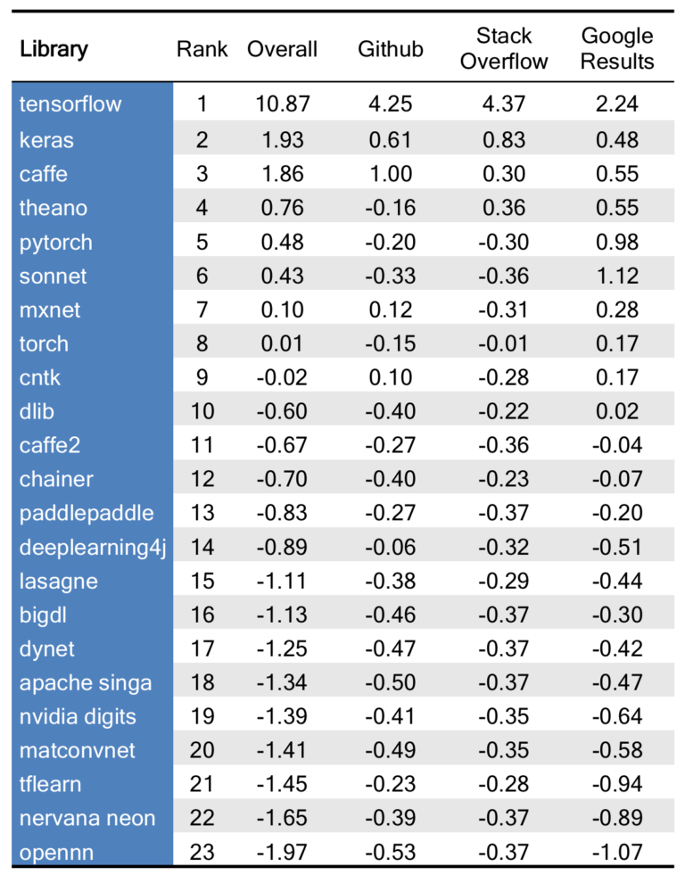
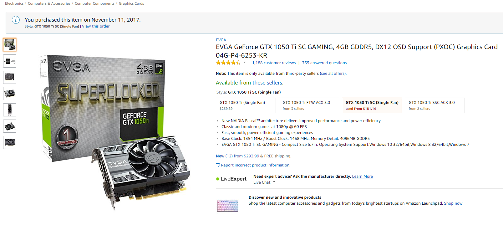
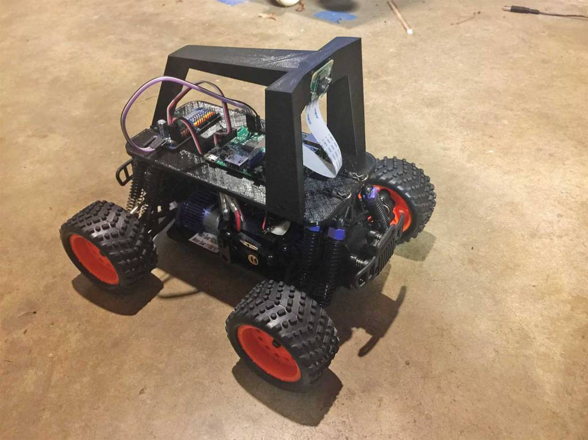

## Introduction

This is a quick introduction to TensorFlow. It was Created for a Lightning Talk given to a Deep Learning Study Group. We are all taking the [Coursera Specialization on Deep Learning](https://www.coursera.org/specializations/deep-learning)

Soon after starting the Coursera DL Course I was also finding references to TensorFlow and started watching some [YouTube videos](https://www.youtube.com/playlist?list=PLOU2XLYxmsIKGc_NBoIhTn2Qhraji53cv) talking about Tensorflow. At the time I was unaware that the course would use TensorFlow.

## Deep Learning Frameworks

The table above was taken from this article: [Ranking Popular Deep Learning Libraries for Data Science](https://blog.thedataincubator.com/2017/10/ranking-popular-deep-learning-libraries-for-data-science/) had TensoFlow way out in the lead:

[Keras](https://keras.io/) was 2nd. Keras is not really a competing framework but a higher level library that can integrate with TF. Last year the author of Keras Francois Chollet [announced](http://www.fast.ai/2017/01/03/keras/) that Keras would be added to TF 

## TensorFlow in 5 minutes

### Execution Model

[This O'Reilly Article](https://www.oreilly.com/learning/hello-tensorflow) explains the TC execution model. It's a delayed execution model. In TF you define a graph then run it.

Delayed Execution has it's detractors and maybe Google is listening because there are efforts to support [eager execution in TF](https://research.googleblog.com/2017/10/eager-execution-imperative-define-by.html).

I do not consider myself an advanced programmer but I don't find the Delayed Execution model that daunting. But perhaps thats because I use Tableau!

## Why Tensorflow?

What makes TensorFlow so popular? I don't know! I have not even looked at any of the other Libraries but I suspect the depth and breadth, performance, and community have a lot to do with it. I get the impression TensorFlow is _democratising_ Deep Learning.

BTW [AWS adopted MXNet](https://aws.amazon.com/mxnet/) and proposed it as an [Apache Incubator project](https://mxnet.apache.org/)). Microsoft seems to be using [CNTK or Cognative Toolkit](https://github.com/Microsoft/CNTK)

## Tensorboard

[TensorBoard](https://www.tensorflow.org/programmers_guide/summaries_and_tensorboard) provides a way to vizualize Deep Learning. [Here](https://youtu.be/eBbEDRsCmv4) is a YouTube Introduction.

As a Tabloid you might be interested in seeing how data vizualization can be applied to help understand complicated processes.

## Installing TensorFlow in a Windows Lab PC with a GPU

### PC 

My Home Lab server not state of the art. It is a 2013 Intel i7 six core with 64GB of memory running Windows 2012. It did not have a great graphics card.

### Which GPU to Buy a GPU

GPUs can be expensive. All the Bitminers are buying them up so the prices are inflated. But for learning Tensorflow a budget GPU can provide significant improvement over a CPU only setup even a six core.

This [blog post](http://timdettmers.com/2017/04/09/which-gpu-for-deep-learning/) by Tim Dettmers has a good overview of the available GPUs as of April 2017 and his experiences with some configurations. 

I bought an EVGA 1050 Ti from [Amazon](https://www.amazon.com/EVGA-GeForce-Support-Graphics-04G-P4-6253-KR/dp/B01MF7EQJZ)

The 1050Ti is a Pascal based GPU.

NVidia is best for Tensorflow because 
It cost me $160 new in November 2017. When I checked on January 31st it is selling used for $181

[Show screenshot of CPU training v GPU training]

### Installing Tensorflow and Prequisite Software

I followed the [instructions](https://www.tensorflow.org/install/install_windows) from the Tensorflow site.

After installing your GPU Card:

* Python Anaconda
* NVidia CUDA
* NVidia Drivers
* cuDNN 
* TensorFlow

### Comparing CPU v GPU

The TensorFlow repository has a [tutorial](https://github.com/tensorflow/models/tree/master/tutorials/image/cifar10) that is based on the [CIFAR-10](https://en.wikipedia.org/wiki/CIFAR-10) Dataset. This dataset is often used as a benchmark for Deep Learning Algorithms and Frameworks.

Here is the cifar10_train.py running on my GPU:

Note that I am getting over 3K examples as second or each batch is taking 0.039 seconds and my CPU is not running that much.

If I switch to the cpu version I get a very different performance.

## An Example Application of Tensorflow

### Donkey Car

The Donkey Car platform is DIY Autonomous Remote Control (RC) car driven by a Raspberry PI and trained using Tensorflow/Keras. The project was created by [Willam Roscoe](https://github.com/wroscoe/donkey) and Adam Conway.

#### Where does DL and Tensorflow come in?

The car is a modified hobby RC car with a camera and Raspberry Pi added to provide the autonomous smarts. The car is trained by driving the car around a track, capturing the video then training a DL netowrk using Keras/Tensorflow. The actual trainng is done on a host PC then the trained network is transferred back to the Raspberry Pi. A well trained car can then drive around the track without human intervention.

You can get more details from the [Donkey Car Home Page](http://www.donkeycar.com/)
