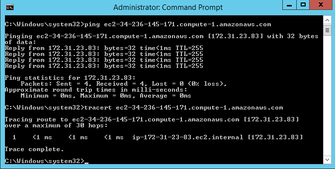
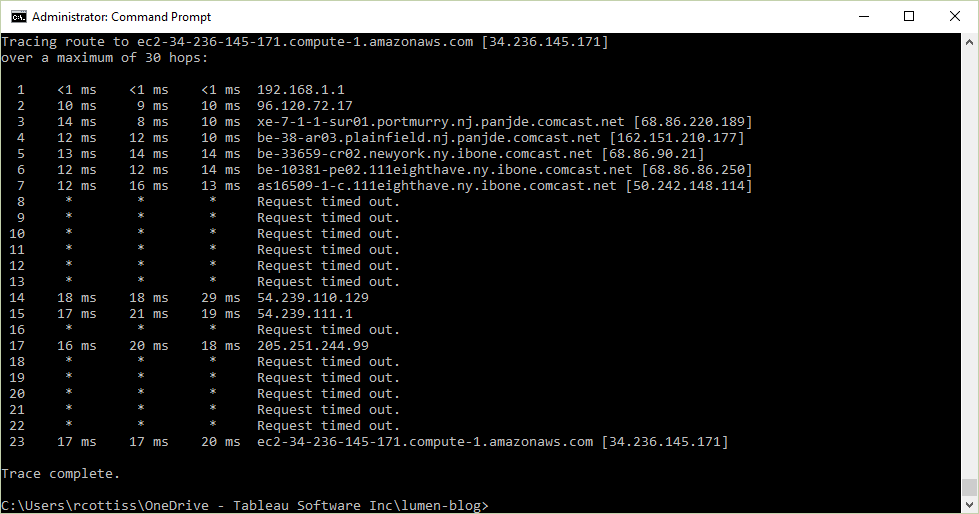

Like most computer applications these days AWS Services are sensitive to network performance. This is relevant to Tableau also as we rely heavily on the network to communicate with clients, databases, workers in a cluster etc.

AWS is great at handling the details but sometimes we need to be confident that the network is configured optimally for our use case. Customers often ask if they can 'speed up' the the network between their Databases and Tableau. This is especially important when the database and Tableau are on AWS because AWS can optimize the network between nodes. What we want to do is make sure that we are taking advantage of these optimal configurations.

I am not a networking expert but I am learning more and more each day.

Here is a small learning that might help you confirm you are wondering just how fast the network is between one service and another.

On Windows you can use tracert

Here is a tracert between a Tableau Server on EC2 and an EMR Cluster I set up recently:

```
tracert ec2-34-236-145-171.compute-1.amazonaws.com
```



Here is the same tracert from my home laptop to the same EMR cluster



```
tracert tableau-redshift-samples.cu5olcu0ugln.us-east-1.redshift.amazonaws.com
```