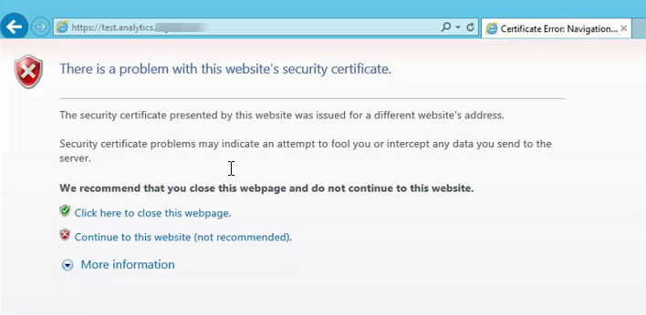
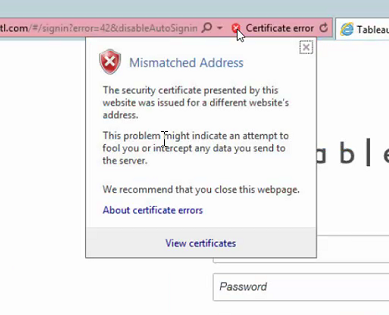
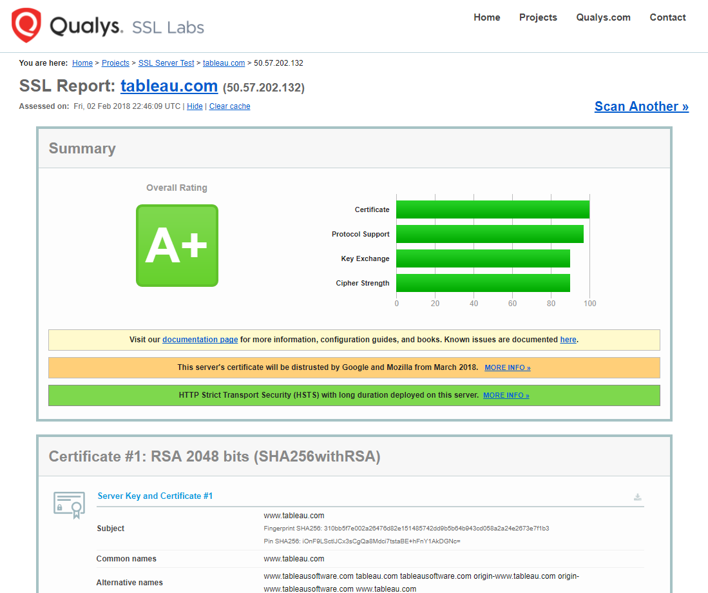
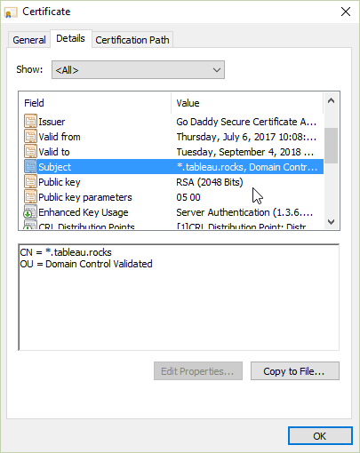
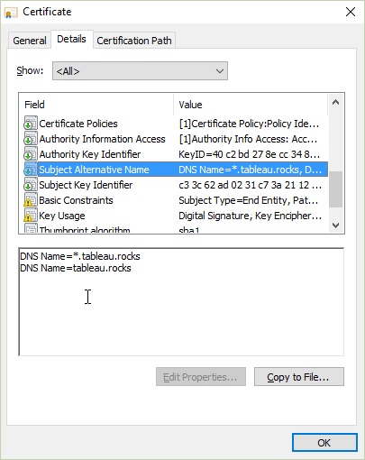

## What's the problem?

If you enable SSL for your Tableau Server you will need an SSL certificate for your Server. We provide some documentation in the [Tableau Server Online Help](https://onlinehelp.tableau.com/current/server/en-us/ssl.htm). We even have some guidance on [generating a Certificate Signin Request (CSR)](https://onlinehelp.tableau.com/current/server/en-us/ssl_cert_create.htm). In larger enterprises the Tableau Administrator will simply ask for the certificate to be provided by another team. That team generally knows the detailed requirements for the certificate but every now and then we see customers that end up with a certificate that does not work as expected. One of the things that can go wrong is that the certificate has the wrong server name in it's Subject Alternate Name (SAN) field. The customer might believe the certificate should work because the right server name is in the Common Name (CN) field. This is no longer true for some web browsers due to loopholes that have been closed. For example in Chrome 58 and later the browser longer checks the CN when validating SSL Certificates. 

You can get some details [here](https://www.thesslstore.com/blog/security-changes-in-chrome-58/) or from the [Chrome Platform Status Page](https://www.chromestatus.com/features/4981025180483584) or even from the [RFC](https://tools.ietf.org/html/rfc6125#section-6.4.4). Thanks to my colleagues Josh and Matt for sharing some of these links when this issue came from a customer today.

## How will the Problem Show Up?

You will get an error in your browser like this one from Internet Explorer

In IE you can continue to the site (not recommended) but you will get a certificate error

## How can I Fix this Problem?

This is a certificate problem so there is nothing you can do in Tableau. You will need a new certificate with your server name is in the SAN field.

Below are some working certificates to show how they use the SAN field. You can examine certificates from your web browser or you can use a tool like the [SSL Server Test](https://www.ssllabs.com/ssltest/index.html) from Qualsys.

Here is the result of the SSL Server test for tableau.com

Note that some certificates are wildcard certificates so a single certificate can be used on many servers.

Here is my certificate for a domain that I own *.tableau.rocks viewed by right clicking on the lock icon in my web browser:

It does have a Common Name in the Subject

but it also has the wildcard in the SAN

This certificate will work on tableau.rocks or www.tableau.rocks etc.