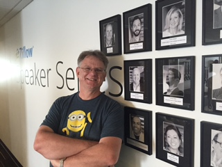
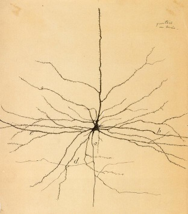
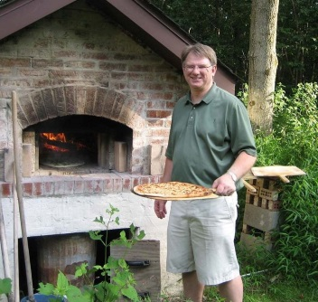

I am an Enterprise Architect in the Customer Consulting organization at Tableau.

I started out wanting to be a research biochemist but got diverted into computing with a detour into laboratory science specializing in neuro-histology. Santiago Ramón y Cajal is a hero of mine.

I have worked as a DBA and Systems Manager, Pre-Sales Engineer and BI Architect for more years than I am willing to disclose. 

I spend my free time failing to find a hobby that takes me away from computers. I took up photography but ended up spending more time in Adobe LightRoom and Photoshop doing post-processing. I have a brick oven to bake bread and pizzas but I made the mistake of embedded thermocouples in it and connecting it to the internet. Recently I took up jigsaw puzzles but I am thinking about building a Tensorflow powered robot to sort the pieces.

